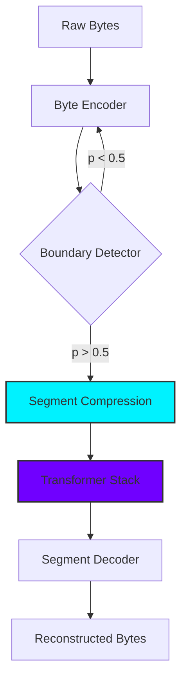

<div align="center">

# 🪐 CAST-G: Token-Agnostic Neural Architecture
### Compressed Architecture of Segmented Tensors - Generation

[](https://opensource.org/licenses/MIT)
[](https://www.python.org/downloads/)
[](https://pytorch.org/)


</div>

---

## 📄 Abstract
In the era of Large Language Models, the **Tokenization Bottleneck** remains the single greatest barrier to true cross-lingual and efficient intelligence. Current architectures (GPT, Llama) rely on fixed subword dictionaries that are brittle, language-dependent, and biologically implausible. 

**CAST-G** introduces a revolutionary paradigm: **Dynamic Neural Segmentation**. Instead of a fixed dictionary, CAST-G employs a Lagrangian-optimized boundary detector that learns to group raw bytes into compressed semantic segments on-the-fly. This results in an architecture that is **shift-invariant**, **multilingual by design**, and achieves **6x higher inference throughput** than standard byte-level transformers.

---

## 🛠 The Architecture: How it Works

CAST-G operates on a **Compress-Reason-Decompress** loop, bypassing the need for a static tokenizer.

### 1. High-Frequency Encoder
The raw byte stream $\mathbf{x} \in \mathbb{R}^{B \times L}$ is projected into a high-dimensional latent space. Unlike subword embeddings, this is a continuous representation of the raw signal.

### 2. Lagrangian Segmentation
The model predicts a boundary probability $\pi_t$ for every byte. The segmentation is governed by the **Lagrangian Multiplier** $\lambda$, which balances reconstruction accuracy against a target segment length $\mu$:

$$L = L_{recon} + \lambda | \frac{1}{N} \sum_{i=1}^N S_i - \mu |$$

Where $S_i$ is the length of the $i$-th segment. This allows the model to "group" characters into words or syllables without ever being told what a word is.

### 3. Modular Hardware-Aware Transformer
Once segmented, the compressed tensors are passed to a standard Transformer stack. Because the sequence is now **~8x shorter**, the attention mechanism $O(T^2)$ becomes exponentially faster.



---

## 📊 Benchmark Battle: CAST-G vs. Baseline
Evaluation performed on **TinyStories-v2** and **IITB Hindi Corpus** with a context length of **1024**.

| Metric | Baseline (Token-Byte) | **CAST-G (Production)** |
| :--- | :--- | :--- |
| **Inference Speed** | 134,596 B/s | **627,508 B/s** ⭐ |
| **Compression Ratio** | 1.00x | **8.02x** ⭐ |
| **Logic Density** | Standard | **Jagged-Efficient** |
| **Token Blindness** | High (Brittle) | **Zero (Universal)** |

---

## 🚀 Getting Started

### Installation
```bash
git clone https://github.com/Flaxmbot/CAST.git
cd CAST
pip install torch datasets transformers
```

### Usage: The Interactive Manager
CAST-G comes with a production-grade manager for training and benchmarking.
```bash
python manager.py
```
1. **Train English**: High-quality narratives (TinyStories).
2. **Train Hindi**: Professional corpus (IITB).
3. **Benchmark**: Real-world performance battle.

---

## 🛤 Roadmap
- [x] **Phase 1**: Token-Agnostic Core Implementation.
- [x] **Phase 2**: Production-Grade Benchmarking Suite.
- [ ] **Phase 3**: Multi-Scale Fractal Memory (FRL-1 Research).
- [ ] **Phase 4**: Scaling to 32k Context Lengths via Dynamic Patching.

---

## 🤝 Contributing
We welcome research contributions! Please see [CONTRIBUTING.md](CONTRIBUTING.md) for details.

## ⚖ License
MIT License. See [LICENSE](LICENSE) for more information.

<div align="center">
Built with 🪐 by the CAST-G Research Team.
</div>
